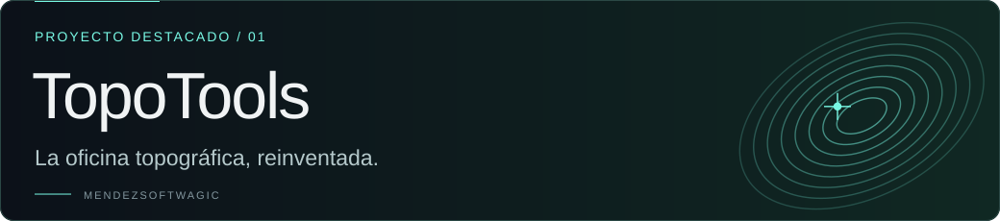

  
  

<a href="https://www.mendezsoftwagic.dev/">
  <picture>
    <source media="(prefers-reduced-motion: reduce)" srcset="./assets/banner-es.png" />
    
  </picture>
</a>

  <a href="https://www.mendezsoftwagic.dev/">Portafolio</a> ·
  <a href="https://www.mendezsoftwagic.dev/#work">Proyectos</a> ·
  <a href="https://www.mendezsoftwagic.dev/#contact">Contacto</a>

  

## La ingeniería detrás de la magia

Soy **estudiante de la Universidad de Costa Rica (UCR)**, en la
[Escuela de Ciencias de la Computación e Informática (ECCI)](https://www.ecci.ucr.ac.cr/).
Construyo **MendezSoftwagic**: software que conecta inteligencia artificial,
tecnología geoespacial y mundos interactivos. Me interesa tanto automatizar un
proceso real como diseñar una experiencia que despierte curiosidad.

Mi enfoque: construir para la realidad, diseñar para sorprender y pensar en cómo
crecerá cada sistema. La idea define la herramienta.

## Proyecto destacado

**En producción · Automatización geoespacial**

Del plano al trabajo de campo: un sistema que conecta lectura de planos,
cotizaciones, dibujo y georreferenciación para el trabajo topográfico.

### Mirá cómo funciona

**[▶ Ver demo de Derrotero OCR](https://www.youtube.com/watch?v=xURthUWKitw)** · Video en español

Leer el plano → revisar y corregir los datos → continuar en dibujo, CAD o avalúos.

**Python · Visión por computadora · PostgreSQL · Sistemas geoespaciales**

[Explorar el caso técnico ↗](https://www.mendezsoftwagic.dev/work/topotools) · [Visitar TopoTools ↗](https://www.topo-tools.com)

## Otros mundos de mi taller

<strong>Prototipo</strong>

Espacios físicos convertidos en geometría. Observaciones LiDAR y referencias GNSS para reconstruir entornos reales.

<a href="https://www.mendezsoftwagic.dev/work/atlas"><strong>Explorar Atlas ↗</strong></a>

<strong>En desarrollo</strong>

Un mundo definido por quien lo habita. Un MMORPG que conecta perfiles astrales, habilidades con IA y progresión souls-like.

<a href="https://www.mendezsoftwagic.dev/work/umbra-caeli"><strong>Explorar Umbra Caeli ↗</strong></a>

<strong>Sistema en uso</strong>

Cada invitado y cada detalle, conectados. Invitaciones digitales, RSVP personalizado y coordinación en una sola experiencia.

<a href="https://www.mendezsoftwagic.dev/work/wedding-manager"><strong>Explorar Wedding Manager ↗</strong></a>

## Cómo construyo

- **TopoTools · Automatizar con revisión.** La lectura OCR produce datos editables que se comparan con el plano original. Las correcciones se guardan antes de continuar en dibujo, CAD o avalúos. [Ver el flujo ↗](https://www.topo-tools.com/modules/derrotero)
- **Atlas · Construir geometría y ubicarla.** El prototipo explora cómo combinar observaciones LiDAR con referencias GNSS para reconstruir entornos y darles una ubicación real. ROS2 forma parte de la exploración futura. [Ver el enfoque ↗](https://www.mendezsoftwagic.dev/work/atlas)
- **Umbra Caeli · Convertir identidad en mecánicas.** El juego en desarrollo parte del perfil astral de cada personaje para plantear habilidades con IA y una progresión propia. [Explorar el diseño ↗](https://www.mendezsoftwagic.dev/work/umbra-caeli)
- **Wedding Manager · Conectar experiencia y operación.** La invitación pública se conecta con un RSVP personalizado por token y un sistema protegido para gestionar invitados, cupos y confirmaciones. [Ver el sistema ↗](https://www.mendezsoftwagic.dev/work/wedding-manager)

<strong>Detrás del diseño: arte generado con código</strong>

Las órbitas del banner, las curvas topográficas, la nube de puntos y las
constelaciones de este perfil se dibujan con Python y SVG. La animación mantiene
la tipografía fija y ofrece una versión estática para quienes prefieren menos movimiento.

- [Generador del banner orbital](./scripts/render_banner.py)
- [Generador de tarjetas y reconocimiento](./scripts/render_projects.py)
- [Cómo regenerar los recursos](./assets/README.md)

## Herramientas de mi taller

  
  
  
  

**Aplicaciones y mundos:** React · Node.js · Express · GSAP · Unreal Engine 5 
**Datos e infraestructura:** PostgreSQL · MongoDB · Docker 
**IA y sistemas espaciales:** visión por computadora · LiDAR · GNSS · diseño procedural

---

¿Una idea ambiciosa? [Conversemos →](https://www.mendezsoftwagic.dev/#contact)

Alquimia de software · Costa Rica · <a href="./assets/banner-es.png">Ver banner sin animación</a> · <a href="./README.md">Read in English</a>
