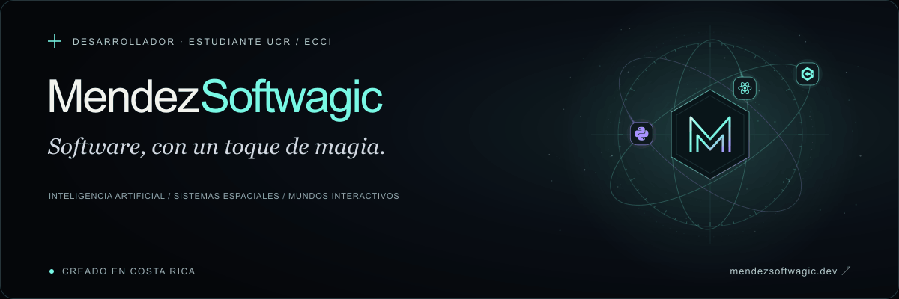
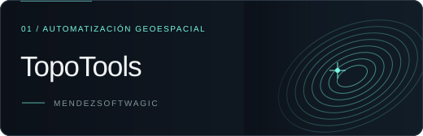
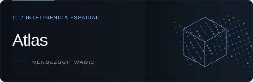
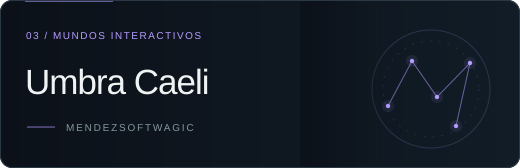
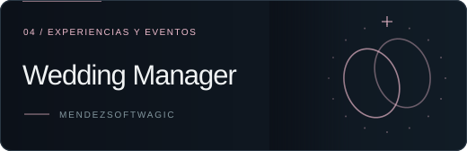

  
  

<a href="https://www.mendezsoftwagic.dev/">
  <picture>
    <source media="(prefers-reduced-motion: reduce)" srcset="./assets/banner-es.png" />
    
  </picture>
</a>

  <a href="https://www.mendezsoftwagic.dev/">Portafolio</a> ·
  <a href="https://www.mendezsoftwagic.dev/#work">Proyectos</a> ·
  <a href="https://www.mendezsoftwagic.dev/#contact">Contacto</a>

  

## La ingeniería detrás de la magia

Soy **estudiante de la Universidad de Costa Rica (UCR)**, en la
[Escuela de Ciencias de la Computación e Informática (ECCI)](https://www.ecci.ucr.ac.cr/).
Construyo **MendezSoftwagic**: software que conecta inteligencia artificial,
tecnología geoespacial y mundos interactivos. Me interesa tanto automatizar un
proceso real como diseñar una experiencia que despierte curiosidad.

Mi enfoque: construir para la realidad, diseñar para sorprender y pensar en cómo
crecerá cada sistema. La idea define la herramienta.

## Cuatro mundos. Un mismo taller.

<table>
  <tr>
    <td width="50%" valign="top">
      
      
Del plano al trabajo de campo. Automatización de cotizaciones topográficas, lectura de planos y dibujo georreferenciado.

      

        
        
        
      

      
<a href="https://www.mendezsoftwagic.dev/work/topotools"><strong>Explorar TopoTools ↗</strong></a>

    </td>
    <td width="50%" valign="top">
      
      
Espacios físicos convertidos en geometría. Observaciones LiDAR y referencias GNSS para reconstruir entornos reales.

      

        
        
        
        
      

      
<a href="https://www.mendezsoftwagic.dev/work/atlas"><strong>Explorar Atlas ↗</strong></a>

    </td>
  </tr>
  <tr>
    <td width="50%" valign="top">
      
      
Un mundo definido por quien lo habita. Un MMORPG que conecta perfiles astrales, habilidades con IA y progresión souls-like.

      

        
        
        
      

      
<a href="https://www.mendezsoftwagic.dev/work/umbra-caeli"><strong>Explorar Umbra Caeli ↗</strong></a>

    </td>
    <td width="50%" valign="top">
      
      
Cada invitado y cada detalle, conectados. Invitaciones digitales, RSVP personalizado y coordinación en una sola experiencia.

      

        
        
        
        
        
      

      
<a href="https://www.mendezsoftwagic.dev/work/wedding-manager"><strong>Explorar Wedding Manager ↗</strong></a>

    </td>
  </tr>
</table>

## Herramientas de mi taller

**Lenguajes**

  
  
  
  

**Aplicaciones, animación y mundos interactivos**

  
  
  
  
  

**Datos e infraestructura**

  
  
  

**IA y sistemas espaciales**

  
  
  
  
  
  

**Explorando para la siguiente etapa de Atlas**

  

---

¿Una idea ambiciosa? [Conversemos →](https://www.mendezsoftwagic.dev/#contact)

Alquimia de software · Costa Rica · <a href="./assets/banner-es.png">Ver banner sin animación</a> · <a href="./README.md">Read in English</a>
