

  
  

<a href="https://www.mendezsoftwagic.dev/">
  <picture>
    <source media="(prefers-reduced-motion: reduce)" srcset="./assets/banner.png" />
    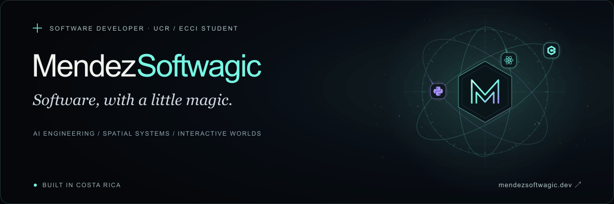
  </picture>
</a>

  <a href="https://www.mendezsoftwagic.dev/">Portfolio</a> ·
  <a href="https://www.mendezsoftwagic.dev/#work">Selected work</a> ·
  <a href="https://www.mendezsoftwagic.dev/#contact">Get in touch</a>

  

## The engineering behind the magic

I'm a **University of Costa Rica (UCR) student** at the
[School of Computer Science and Informatics (ECCI)](https://www.ecci.ucr.ac.cr/).
I build **MendezSoftwagic**: software that connects artificial intelligence,
geospatial technology and interactive worlds. I enjoy automating real workflows
as much as designing experiences that spark curiosity.

My approach: build for reality, design for wonder, and think about how each
system will grow. The idea defines the tool.

## Four worlds. One workshop.

<table>
  <tr>
    <td width="50%" valign="top">
      <a href="https://www.mendezsoftwagic.dev/work/topotools">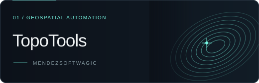</a>
      
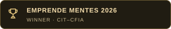

      
From source plan to field-ready work. Automating surveying quotes, plan reading and georeferenced drafting.

      

        
        
        
      

      
<a href="https://www.mendezsoftwagic.dev/work/topotools"><strong>Explore TopoTools ↗</strong></a>

    </td>
    <td width="50%" valign="top">
      <a href="https://www.mendezsoftwagic.dev/work/atlas">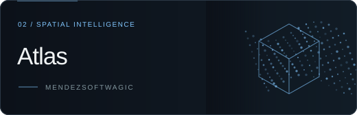</a>
      
Turning physical spaces into geometry. Combining LiDAR observations and GNSS anchors for spatial reconstruction.

      

        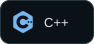
        
        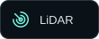
        
      

      
<a href="https://www.mendezsoftwagic.dev/work/atlas"><strong>Explore Atlas ↗</strong></a>

    </td>
  </tr>
  <tr>
    <td width="50%" valign="top">
      <a href="https://www.mendezsoftwagic.dev/work/umbra-caeli">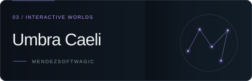</a>
      
A world shaped by the player. An MMORPG connecting natal profiles, AI-powered abilities and souls-like progression.

      

        
        
        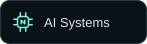
      

      
<a href="https://www.mendezsoftwagic.dev/work/umbra-caeli"><strong>Explore Umbra Caeli ↗</strong></a>

    </td>
    <td width="50%" valign="top">
      <a href="https://www.mendezsoftwagic.dev/work/wedding-manager">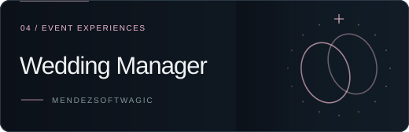</a>
      
Every guest, every detail, connected. Digital invitations, personalized RSVP and guest coordination in one experience.

      

        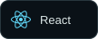
        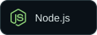
        
        
        
      

      
<a href="https://www.mendezsoftwagic.dev/work/wedding-manager"><strong>Explore Wedding Manager ↗</strong></a>

    </td>
  </tr>
</table>

## Tools of the craft

**Languages**

  
  
  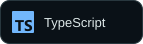
  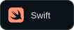

**Applications, animation & interactive worlds**

  
  
  
  
  

**Data & infrastructure**

  
  
  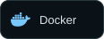

**AI & spatial systems**

  
  
  
  
  
  

**Exploring for the next stage of Atlas**

  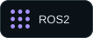

---

Have an ambitious idea? [Let's talk →](https://www.mendezsoftwagic.dev/#contact)

Software alchemy · Costa Rica · <a href="./assets/banner.png">View still banner</a> · <a href="./README.es.md">Leer en español</a>
