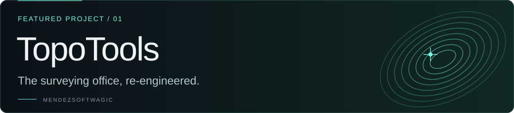
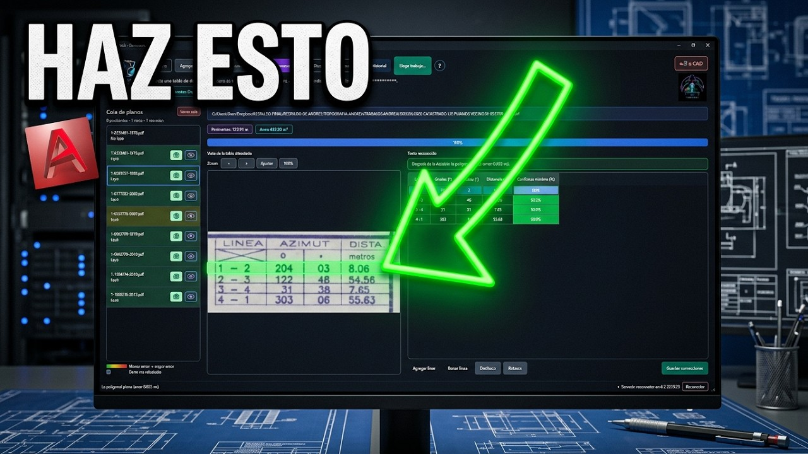

  
  

<a href="https://www.mendezsoftwagic.dev/">
  <picture>
    <source media="(prefers-reduced-motion: reduce)" srcset="./assets/banner.png" />
    
  </picture>
</a>

  <a href="https://www.mendezsoftwagic.dev/">Portfolio</a> ·
  <a href="https://www.mendezsoftwagic.dev/#work">Selected work</a> ·
  <a href="https://www.mendezsoftwagic.dev/#contact">Get in touch</a>

  

## The engineering behind the magic

I'm a **University of Costa Rica (UCR) student** at the
[School of Computer Science and Informatics (ECCI)](https://www.ecci.ucr.ac.cr/).
I build **MendezSoftwagic**: software that connects artificial intelligence,
geospatial technology and interactive worlds. I enjoy automating real workflows
as much as designing experiences that spark curiosity.

My approach: build for reality, design for wonder, and think about how each
system will grow. The idea defines the tool.

## Featured project

**In production · Geospatial automation**

From source plan to field-ready work: one system connecting plan reading,
quoting, drafting and georeferencing for surveying workflows.

### See it in action

**[▶ Watch the Derrotero OCR demo](https://www.youtube.com/watch?v=xURthUWKitw)** · Video in Spanish

Read the plan → review and correct the data → continue in drafting, CAD or valuation.

**Python · Computer Vision · PostgreSQL · Geospatial**

[Explore the technical case study ↗](https://www.mendezsoftwagic.dev/work/topotools) · [Visit TopoTools ↗](https://www.topo-tools.com)

## Other worlds from my workshop

<strong>Prototype</strong>

Turning physical spaces into geometry. Combining LiDAR observations and GNSS anchors for spatial reconstruction.

<a href="https://www.mendezsoftwagic.dev/work/atlas"><strong>Explore Atlas ↗</strong></a>

<strong>In development</strong>

A world shaped by the player. An MMORPG connecting natal profiles, AI-powered abilities and souls-like progression.

<a href="https://www.mendezsoftwagic.dev/work/umbra-caeli"><strong>Explore Umbra Caeli ↗</strong></a>

<strong>Live event system</strong>

Every guest, every detail, connected. Digital invitations, personalized RSVP and guest coordination in one experience.

<a href="https://www.mendezsoftwagic.dev/work/wedding-manager"><strong>Explore Wedding Manager ↗</strong></a>

## How I build

- **TopoTools · Automation with review.** OCR produces editable data that can be compared with the original plan. Corrections are saved before continuing in drafting, CAD or valuation. [See the workflow ↗](https://www.topo-tools.com/modules/derrotero)
- **Atlas · Build geometry and anchor it.** The prototype explores how to combine LiDAR observations with GNSS references to reconstruct environments and place them in the real world. ROS2 is a future exploration. [See the approach ↗](https://www.mendezsoftwagic.dev/work/atlas)
- **Umbra Caeli · Turn identity into mechanics.** The game in development starts from each character's natal profile to explore AI-powered abilities and individual progression. [Explore the design ↗](https://www.mendezsoftwagic.dev/work/umbra-caeli)
- **Wedding Manager · Connect experience and operations.** The public invitation connects to personalized token-based RSVP and a protected system for managing guests, capacity and confirmations. [See the system ↗](https://www.mendezsoftwagic.dev/work/wedding-manager)

<strong>Behind the design: artwork generated with code</strong>

The banner's orbits, topographic contours, point cloud and constellations in
this profile are drawn with Python and SVG. The animation keeps typography
still and offers a static version for viewers who prefer reduced motion.

- [Orbital banner generator](./scripts/render_banner.py)
- [Project card and recognition generator](./scripts/render_projects.py)
- [How to regenerate the assets](./assets/README.md)

## Tools of the craft

  
  
  
  

**Applications & worlds:** React · Node.js · Express · GSAP · Unreal Engine 5 
**Data & infrastructure:** PostgreSQL · MongoDB · Docker 
**AI & spatial systems:** computer vision · LiDAR · GNSS · procedural design

---

Have an ambitious idea? [Let's talk →](https://www.mendezsoftwagic.dev/#contact)

Software alchemy · Costa Rica · <a href="./assets/banner.png">View still banner</a> · <a href="./README.es.md">Leer en español</a>
